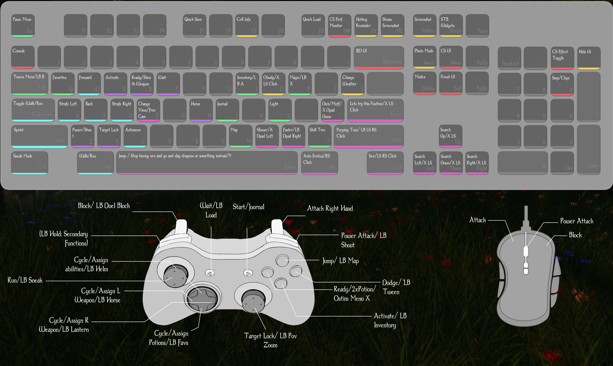

# 🎮 Nymph’s Savage World – Controller Guide

---
⚠️ **Important Setup Required**  
This guide only works if you download and apply the following Steam Controller Configuration:  

👉 [Apply Steam Config](steam://controllerconfig/489830/14)  

If clicking the link above doesn’t work on GitHub, copy and paste this into your browser or the Windows Run box:  

steam://controllerconfig/489830/14

**Desktop Mode (no Big Picture needed):**  
1. In Steam, right-click **Skyrim Special Edition** in your Library.  
2. Select **Manage → Controller Layout**.  
3. Choose **Browse Configs → Community**.  
4. Search for **Nymph’s Savage World Config** (ID: `14`) and apply it.  

**Big Picture Mode (optional):**  
1. Open Steam in **Big Picture Mode**.  
2. Go to **Skyrim Special Edition → Manage → Controller Layout**.  
3. Select **Browse Configs → Community**.  
4. Search for **Nymph’s Savage World Config** (ID: `14`) and apply it.  

---

## 🕹️ Movement
| Button | Action |
|--------|--------|
| Left Stick | Move |
| Press L3 | Roll Dodge *(TK Dodge)* |
| Hold L3 | Sprint |
| LB + L3 | Sneak Mode |
| Right Stick | Camera |
| Press R3 | Target Lock |
| LB + Right Stick (move) | Smooth Zoom (3rd ↔ 1st) |
| LB + R3 | Instant POV Toggle |

---

## ⚔️ Combat
| Button | Action |
|--------|--------|
| RT | Attack (Right Hand) |
| LT | Block |
| LB + LT | Duel Block |
| RB | Power Attack *(OCPA required)* |
| LB + RB | Shout |
| A | Activate |
| LB + A | Inventory |
| B | Roll Dodge *(TK Dodge)* |
| Hold B | Sprint |
| LB + B | Tween Menu |
| X | Ready / Sheath |
| Double-Tap X | Consume Potion *(Soulsy HUD)* |
| Y | Jump |
| LB + Y | Map |

---

## 📦 Inventories & Menus
| Button | Action |
|--------|--------|
| LB + D-Pad Down | Favorites Menu |
| D-Pad Left | Assign Left Hand (in menus) / Cycle Left Hand (out of menus) |
| D-Pad Right | Assign Right Hand (in menus) / Cycle Right Hand (out of menus) |
| D-Pad Up | Assign Ability/Shout (in menus) / Cycle Abilities/Shouts (out of menus) |
| D-Pad Down | Assign Potion (in menus) / Cycle Potions (out of menus) |

---

## 📜 System Menus
| Button | Action |
|--------|--------|
| Select | Wait Menu |
| LB + Select | Quick Load |
| Start | Pause Menu |
| LB + Start | Journal |

---

## 🎭 OStim Scene Controls
| Button | Action |
|--------|--------|
| L3 + R3 | Start Scene (Player + NPC) |
| LB + L3 + R3 | Start Scene (NPC + NPC) |
| R3 | Auto-Play |
| LB + R3 | Free Camera |
| Y | Exit Scene |
| Hold X + Move LS | Animation Selection Menu |
| L3 (while in menu) | Confirm Animation |
| Hold X + D-Pad Right | Speed Up Animation |
| Hold X + D-Pad Left | Slow Down Animation |

**OStim Settings Required**  
Download the matching OStim settings archive:  
➡️ [OStim.7z](https://github.com/Babyjawz/nymphs-savage-world/raw/refs/heads/main/Submissions/OStim.7z)  

Unzip the archive into the following folder:  
C:\Users<YourName>\Documents\My Games\Skyrim Special Edition\

*(Replace `<YourName>` with your Windows account name.)*  
This will ensure all scene controls match this guide.  
(will be included in the next 1.0.5 beta of Nymphs savage World Modlist)
---

## 🌐 Universal Shortcuts
| Button | Action |
|--------|--------|
| Hold X + D-Pad Down | Genitalia Modification |
| Hold X + L3 | OBody Menu |

---
## 🎮 Quick Start: How to Use the Controller

This setup turns your **Steam-compatible controller** (Xbox, PlayStation, Switch Pro, or any other pad supported by Steam Input) into a full Skyrim control scheme designed for **Nymph’s Savage World**.  

The guide uses **Xbox button names** (A/B/X/Y, LB/RB, etc.) for clarity, but the bindings will still work on PlayStation, Switch, or other controllers — only the button labels differ.  

✨ **Recommended**: [Soulsy HUD](https://www.nexusmods.com/skyrimspecialedition/mods/96210)  
Not required, but highly recommended for the full experience. It unlocks **quick-assign and cycling features** on the D-Pad for weapons, powers, shouts, and potions. (*Soulsy HUD is already bundled in Nymph’s Savage World — just make sure it’s enabled.*)  

⚙️ **OStim Configs**:  
If you use OStim, install the included config files by unzipping them into:  
C:\Users<YourName>\Documents\My Games\Skyrim Special Edition\OStim

This ensures all scene controls (stick clicks, speed control, animation selection, etc.) match this guide.  

Once applied:  
- **Play Skyrim normally** with the controller — movement, combat, menus, and exploration all work as expected.  
- **LB (Left Bumper)** is your **“modifier key”**. Holding LB changes what many other buttons do (for example: *LT blocks*, but *LB+LT performs a Duel Block*).  
- **Soulsy HUD integration**: Use the D-Pad to quickly equip weapons, powers, or potions without opening menus. Assign items in your inventory, then cycle them with the D-Pad while playing.  
- **Menus are accessible** with simple combos: LB+A opens inventory, LB+B opens the Tween menu, LB+Y shows the map, LB+Select quickloads, LB+Start opens the Journal.  
- **OStim support**: If installed, you can start and manage scenes using stick clicks and X+D-Pad combos. 
- **Universal shortcuts** (always available): Hold X + D-Pad Down modifies bodies, and Hold X + L3 opens the OBody menu.  

👉 Think of LB as the “magic shift key” that unlocks extra layers of control.  
If something doesn’t respond the first time (like Sprint or Dodge), try the alternative method — both are included for flexibility.  

You don’t need to memorize everything at once:  
1. Start with **movement and combat basics**.  
2. Add **Soulsy HUD** quick-assigns for faster item/power use.  
3. Learn **menus** (LB + face buttons).  
4. Explore **OStim scene controls** once you’re comfortable.  

## ⚠️ Notes & Limitations
- **Dodge & Sprint (L3 / B):** Both mapped for dodge (tap) and sprint (hold). Neither is perfectly reliable, so both are included for flexibility.  
- **Horse & Lantern hotkeys:** Do nothing if no hotkey is assigned in your setup.  
- **OStim actions:** Speed control/selection depend on animation support. Free Camera & Auto-Play are always available.  
- **Universal shortcuts:** `X + D-Pad Down` and `X + L3` are global, usable outside OStim.  
- **Hold-X layer:** Can get stuck (prevents forward movement). Hold/release or tap **X** to reset.  
- **Power Attack (RB):** Requires **One Click Power Attack (OCPA)**. Without it, this action is not available.

  ---

## 🧪 Notes From Testing

This config is still being tested, but so far I’m very happy with the improvements.  
It solves several long-standing problems that have bugged me since playing Skyrim on controller:

1. **Terrible vanilla zoom system** → replaced with smooth zoom that no longer interferes with target lock.  
2. **Sneak auto-triggering mid-combat** → now requires LB + Left Stick click, no more accidental deaths.  
3. **Unreliable vanilla sprint** → now has dual inputs (L3 or B hold) for consistency.  
4. **OStim only working on extended keyboards** → now fully mapped for controller, no keypad required.  
5. **Unified config** → one layout that works with both controller *and* keyboard, no need to maintain two setups.  

---

💬 If anything is unclear, or you run into problems: **please ask!**  
Feedback is welcome while testing continues — this guide and config will improve over time.

