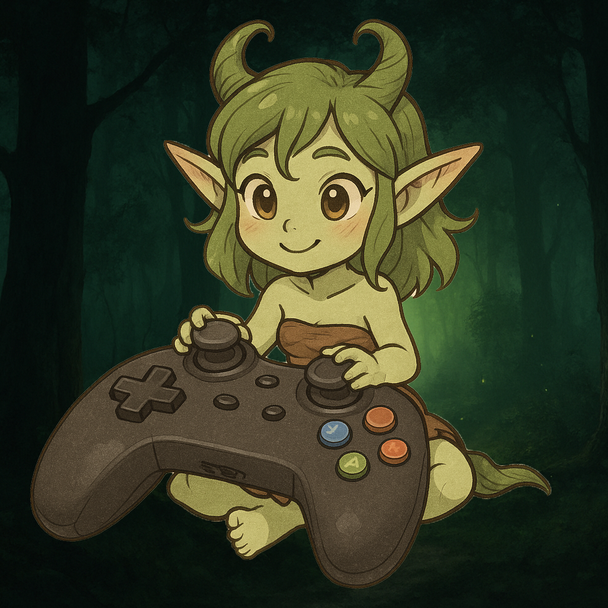

# 🎮 Nymph’s Savage World – Controller Guide

---

⚠️ **Important Setup Required**

 **Apply the Steam Controller Configuration**  
   👉 Copy/paste this into your browser or the Windows **Run** box, then apply the config:

       steam://controllerconfig/489830/3615471212

   **If the above method doesn’t work:**

**Desktop Mode (no Big Picture needed):**  
- In Steam, right-click **Skyrim Special Edition** in your Library.  
- **Manage → Controller Layout** → **Browse Configs → Community**.  
- Search **Nymph’s Savage World Config** (ID: `3570734209`) and apply.

**Big Picture Mode (optional):**  
- **Big Picture → Skyrim SE → Manage → Controller Layout**.  
- **Browse Configs → Community** → apply **Nymph’s Savage World Config** (ID: `3572957129`).

---

## Requirements

  Provides the custom controlmap, `.ini` settings, and an **OStim MCM Recorder profile**.
* **[OStim Settings Folder (GitHub mirror)](https://github.com/Babyjawz/nymphs-savage-world/raw/refs/heads/main/Submissions/OStim.7z)**  
  *(Needed for OStim scene controls. The same folder is also included in Nymphs – Controller. You only need to copy it manually if you **don’t use MCM Recorder**.)*
* **[Soulsy HUD](https://www.nexusmods.com/skyrimspecialedition/mods/74460)** — *Optional but fully recommended; already preconfigured.*

---

## What This Mod Includes

This package is more than just a controlmap — it’s a **complete out-of-the-box setup** for Skyrim AE:

* **Custom Controlmap**
  * `Interface\Controls\PC\controlmap.txt` → editable text map for SKSE / Auto Input Switch  
  * `ControlMap_Custom.txt` (root) → precompiled snapshot, so **you don’t need to Reset Controls** in Skyrim

* **Preconfigured Settings**
  * `.ini` files for:
    * One Click Power Attack
    * TK Dodge
    * True Directional Movement (target lock, sprint, dodge, etc.)

* **OStim Settings**  
  This setup comes with two parts:
  1) **MCM Recorder Profile** — bundled inside **Nymphs – Controller**. If you use [MCM Recorder](https://www.nexusmods.com/skyrimspecialedition/mods/61719), it **auto-configures** OStim.  
  2) **OStim Settings Folder** — provided **both** in the Nexus mod and on GitHub.  
     *If you **don’t** use MCM Recorder, you **must** manually copy it to:*  
     `C:\Users\<YourName>\Documents\My Games\Skyrim Special Edition\OStim`

---

## Notes

* Keep this mod **low in LO** so no other controlmap replacer wins.  
* If you press **Reset Controls** in Skyrim, the game regenerates a new `ControlMap_Custom.txt` that can override this snapshot.  
  If bindings break after a reset, delete the new `ControlMap_Custom.txt` so the packaged one takes effect again.

---

## Why This Matters

* Consistent gameplay/combat behavior with controller bindings  
* Saves time vs. tweaking MCMs manually  
* Ready-to-use settings for common animation/combat mods  
* Works immediately on a new save thanks to the compiled controlmap

---

## 🕹️ Movement

| Button | Action |
|---|---|
| Left Stick | Move |
| Press L3 | Roll Dodge *(TK Dodge)* |
| Hold L3 | Sprint |
| LB + L3 | Sneak Mode |
| Right Stick | Camera |
| Press R3 | Target Lock |
| LB + Right Stick (move) | Smooth Zoom (3rd ↔ 1st) |
| LB + R3 | Instant POV Toggle |
| LB + (double-tap) R3 | Shoulder Swap *(requires SmoothCam)* |

---

## ⚔️ Combat

<table>
<tr>
<td>

| Button | Action |
|---|---|
| RT | Attack (Right Hand) |
| LT | Block |
| LB + LT | Duel Block |
| RB | Power Attack *(OCPA required)* |
| LB + RB | Shout |
| A | Activate |
| LB + A | Inventory |
| B | Roll Dodge *(TK Dodge)* |
| Hold B | Sprint |
| LB + B | Tween Menu |
| X | Ready / Sheath |
| Double-Tap X | Consume Potion *(Soulsy HUD)* |
| Y | Jump |
| LB + Y | Map |

</td>
<td width="350" align="center">

</td>
</tr>
</table>

---

## 📦 Inventories & Menus

| Button | Action |
|---|---|
| LB + D-Pad Down | Favorites Menu |
| D-Pad Left | Assign Left Hand (menus) / Cycle Left Hand (gameplay) |
| D-Pad Right | Assign Right Hand (menus) / Cycle Right Hand (gameplay) |
| D-Pad Up | Assign Ability/Shout (menus) / Cycle Abilities/Shouts (gameplay) |
| D-Pad Down | Assign Potion (menus) / Cycle Potions (gameplay) |
| LB + D-Pad Left | Horse (if assigned) |
| LB + D-Pad Right | Lantern (if assigned) |

---

## 📜 System Menus

| Button | Action |
|---|---|
| Select | Wait Menu |
| LB + Select | Quick Load |
| Start | Pause Menu |
| LB + Start | Journal |

---

## 🎭 OStim Scene Controls

| Button | Action |
|---|---|
| L3 + R3 | Start Scene (Player + NPC) |
| LB + L3 + R3 | Start Scene (NPC + NPC) |
| R3 | Auto-Play |
| LB + R3 | Free Camera |
| B | Exit Scene |
| Hold X + Move LS | Animation Selection Menu |
| L3 (in menu) | Confirm Animation |
| Hold X + D-Pad Right | Speed Up Animation |
| Hold X + D-Pad Left | Slow Down Animation |
| Hold X + D-Pad Up | Open OBody Menu |
| Hold X + D-Pad Down | Open TNG Genitalia Menu |
| Hold X + L3 | Open OStim Animation Menu |

**OStim setup note:** Uses the OStim settings in **Requirements**.  
- With **MCM Recorder**: the bundled profile auto-applies.  
- Without **MCM Recorder**: manually copy the folder to `C:\Users\<YourName>\Documents\My Games\Skyrim Special Edition\OStim`.

---

## ⚠️ Notes & Limitations

- **Dodge & Sprint (L3 / B):** Both mapped (tap vs. hold) for reliability.  
- **Horse & Lantern hotkeys:** Do nothing if unassigned.  
- **OStim actions:** Speed/selection depend on animation support. Free Camera & Auto-Play always available.  
- **Universal shortcuts:** `X + D-Pad Up` opens OBody, `X + D-Pad Down` opens TNG Genitalia.  
- **OStim-only shortcut:** `X + L3` opens the OStim animation menu.  
- **Hold-X layer:** Can get “stuck” (blocks forward). Tap **X** to reset.  
- **Power Attack (RB):** Requires **One Click Power Attack (OCPA)**.  
- **Shoulder Swap (LB double-tap + R3):** Requires [SmoothCam](https://www.nexusmods.com/skyrimspecialedition/mods/41252).

---

## 🧪 Notes From Testing

1. Smooth Zoom replaces vanilla zoom without breaking lock-on.  
2. Safer Sneak: **LB+L3** prevents accidental crouch mid-fight.  
3. Sprint redundancy: **L3** or **Hold B**.  
4. OStim is fully usable on controller (no numpad).  
5. Unified config for controller + keyboard.  
6. SmoothCam shoulder swap feels natural.

---

## 🛠️ Troubleshooting

- **Clear old controlmap files:** delete `controlmap_custom.txt` from MO2 **Overwrite**.   
- **Re-apply Steam config:** use the link above or **Manage → Controller Layout** in Steam.

💬 Hit us up on Discord if you get stuck — feedback helps polish the setup.

---

## ⚡ Mini Quick Start Recap

- **Left Stick** → Move; **L3** Dodge; **Hold L3** Sprint  
- **Right Stick** → Camera; **R3** Lock Target; **LB+RS** Smooth Zoom  
- **LB** is your **modifier** for menus/shout/block variants  
- **LB + double-click R3** → Shoulder Swap *(SmoothCam)*  
- **D-Pad (Soulsy HUD)** → cycle (assign while in inventories) weapons/shouts/potions  
- **LB + A/B/Y** → Inventory / Tween / Map  
- **LB + D-Pad Left/Right** → Horse / Lantern (if mods installed)  
- **OStim** → sticks start scenes; **X+Up** OBody; **X+Down** TNG; **X+L3** OStim menu; **Y** exits
