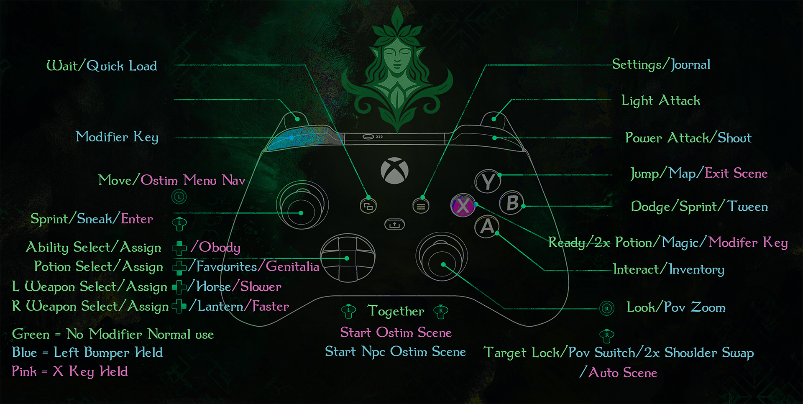

# 🎮 Nymph’s Savage World – Controller Guide

---

⚠️ **Important Setup Required**

1. **Clear old controlmap files**  
   Before doing anything else, check your **Overwrite** folder in Mod Organizer 2.  
   If there is a file called `controlmap_custom.txt`, delete it.  
   (Old controlmaps will conflict with this Steam Input setup.)  

2. **Apply the Steam Controller Configuration**  
   👉 [Apply Steam Config] copy and paste this into your browser or the Windows Run box:
   
         steam://controllerconfig/489830/3570734209

   and apply the config

   **If the above method doesn’t work:**  

**Desktop Mode (no Big Picture needed):**  
- In Steam, right-click **Skyrim Special Edition** in your Library.  
- Select **Manage → Controller Layout**.  
- Choose **Browse Configs → Community**.  
- Search for **Nymph’s Savage World Config** (ID: `3570734209`) and apply it.  

**Big Picture Mode (optional):**  
- Open Steam in **Big Picture Mode**.  
- Go to **Skyrim Special Edition → Manage → Controller Layout**.  
- Select **Browse Configs → Community**.  
- Search for **Nymph’s Savage World Config** (ID: `3570734209`) and apply it.  

---

## Controller / Keybinding Requirements

⚠️ **Important:** This mod must be placed **low in your load order (LO)** or its keybinds/widgets can be overridden.

---

## Requirements

* **[Nymphs – Controller (MO2 one-click link)](https://www.nexusmods.com/Core/Libs/Common/Widgets/DownloadPopUp?id=667335&game_id=1704&nmm=1)**
* **[Nymphs – Controller (Manual Download)](https://www.nexusmods.com/skyrimspecialedition/mods/667335)**
  * Provides the custom controlmap, `.ini` settings, and an OSTIM MCM Recorder profile.
* **[OStim Settings Folder (GitHub mirror)](https://github.com/Babyjawz/nymphs-savage-world/raw/refs/heads/main/Submissions/OStim.7z)**  
  *(Needed for OStim scene controls. The same folder is also included in the Nymphs – Controller mod. You only need to copy it manually if you **don’t use MCM Recorder**.)*
* **[Soulsy HUD](https://www.nexusmods.com/skyrimspecialedition/mods/74460)**  
  *(Optional but fully recommended, already preconfigured for this setup.)*

---

## What This Mod Includes

This controller package is more than just a controlmap — it provides a **complete out-of-the-box setup** for Skyrim AE:

* **Custom Controlmap**
  * `Interface\Controls\PC\controlmap.txt` → editable text map for SKSE / Auto Input Switch  
  * `ControlMap_Custom.txt` (root folder) → precompiled snapshot, so **you don’t need to Reset Controls** in Skyrim  

* **Preconfigured Settings**
  * `.ini` files for:
    * One Click Power Attack  
    * TK Dodge  
    * True Directional Movement (target lock, sprint, dodge, etc.)  

* **OStim Settings**  
  This setup comes with two parts:  

  1. **MCM Recorder Profile** – bundled in the Nymphs – Controller mod.  
     * If you use [MCM Recorder](https://www.nexusmods.com/skyrimspecialedition/mods/61719), this profile will auto-configure OSTIM for you.  

  2. **OStim Settings Folder** – provided both inside the Nymphs – Controller mod and here on GitHub.  
     * ⚠️ If you **do not use MCM Recorder**, you **must** manually copy this folder into your documents:  
       `C:\Users\<YourName>\Documents\My Games\Skyrim Special Edition\OStim`

---

## Notes

* Place this mod **low in your load order** so no other controlmap replacers override it.  
* If you ever press **Reset Controls** in Skyrim, the game will regenerate a new `ControlMap_Custom.txt`. That can override this snapshot.  
  * If your bindings stop working after a reset, simply delete the new `ControlMap_Custom.txt` and let the packaged one take effect again.  

---

## Why This Matters

* Ensures consistent gameplay and combat behavior with controller bindings  
* Saves you from having to tweak MCM menus manually  
* Provides ready-to-use settings for common animation/combat mods  
* Works immediately on a new save thanks to the bundled compiled controlmap  

---

## 🕹️ Movement
| Button | Action |
|--------|--------|
| Left Stick | Move |
| Press L3 | Roll Dodge *(TK Dodge)* |
| Hold L3 | Sprint |
| LB + L3 | Sneak Mode |
| Right Stick | Camera |
| Press R3 | Target Lock |
| LB + Right Stick (move) | Smooth Zoom (3rd ↔ 1st) |
| LB + R3 | Instant POV Toggle |
| LB (double-tap) + R3 | Shoulder Swap *(requires SmoothCam)* |

---

## ⚔️ Combat
| Button | Action |
|--------|--------|
| RT | Attack (Right Hand) |
| LT | Block |
| LB + LT | Duel Block |
| RB | Power Attack *(OCPA required)* |
| LB + RB | Shout |
| A | Activate |
| LB + A | Inventory |
| B | Roll Dodge *(TK Dodge)* |
| Hold B | Sprint |
| LB + B | Tween Menu |
| X | Ready / Sheath |
| Double-Tap X | Consume Potion *(Soulsy HUD)* |
| Y | Jump |
| LB + Y | Map |

---

## 📦 Inventories & Menus
| Button | Action |
|--------|--------|
| LB + D-Pad Down | Favorites Menu |
| D-Pad Left | Assign Left Hand (menus) / Cycle Left Hand (gameplay) |
| D-Pad Right | Assign Right Hand (menus) / Cycle Right Hand (gameplay) |
| D-Pad Up | Assign Ability/Shout (menus) / Cycle Abilities/Shouts (gameplay) |
| D-Pad Down | Assign Potion (menus) / Cycle Potions (gameplay) |

---

## 📜 System Menus
| Button | Action |
|--------|--------|
| Select | Wait Menu |
| LB + Select | Quick Load |
| Start | Pause Menu |
| LB + Start | Journal |

---

## 🎭 OStim Scene Controls
| Button | Action |
|--------|--------|
| L3 + R3 | Start Scene (Player + NPC) |
| LB + L3 + R3 | Start Scene (NPC + NPC) |
| R3 | Auto-Play |
| LB + R3 | Free Camera |
| Y | Exit Scene |
| Hold X + Move LS | Animation Selection Menu |
| L3 (while in menu) | Confirm Animation |
| Hold X + D-Pad Right | Speed Up Animation |
| Hold X + D-Pad Left | Slow Down Animation |

⚠️ **OStim Settings Profile Required**  
This setup relies on the OSTIM profile (bundled for MCM Recorder, or the manually copied folder).  
- With **MCM Recorder**: the profile auto-loads.  
- Without **MCM Recorder**: you **must manually copy** the provided OStim folder into:  
  `C:\Users\<YourName>\Documents\My Games\Skyrim Special Edition\OStim`

Once applied:  
- **Play Skyrim normally** with the controller — movement, combat, menus, and exploration all work as expected.  
- **LB (Left Bumper)** is your **“modifier key”**. Holding LB changes what many other buttons do.  
- **Soulsy HUD integration** (if installed): Use the D-Pad to quickly equip weapons, powers, or potions without opening menus.  
- **Menus are accessible** with LB + A/B/Y for Inventory, Tween Menu, Map.  
- **OStim support**: If installed, you can start and manage scenes using stick clicks and X+D-Pad combos.  

---

## ⚠️ Notes & Limitations
- **Dodge & Sprint (L3 / B):** Both mapped for dodge (tap) and sprint (hold). Neither is perfectly reliable, so both are included.  
- **Horse & Lantern hotkeys:** Do nothing if unassigned.  
- **OStim actions:** Speed control/selection depend on animation support. Free Camera & Auto-Play are always available.  
- **Universal shortcuts:** `X + D-Pad Down` and `X + L3` are global, usable outside OStim.  
- **Hold-X layer:** Can get stuck (prevents forward movement). Tap **X** to reset.  
- **Power Attack (RB):** Requires **One Click Power Attack (OCPA)**.  
- **Shoulder Swap (LB double-tap + R3):** Requires [SmoothCam](https://www.nexusmods.com/skyrimspecialedition/mods/41252).  

---

## 🧪 Notes From Testing
1. Smooth Zoom replaces vanilla zoom and doesn’t interfere with lock-on.  
2. Sneak is safer: LB+L3 prevents accidental crouch mid-combat.  
3. Sprint redundancy: L3 or Hold B.  
4. OStim fully playable without a numpad.  
5. Unified config: works with both controller + keyboard.  
6. Shoulder Swap with SmoothCam feels natural.  

---

## 🛠️ Troubleshooting
- **Clear old controlmap files** → Delete `controlmap_custom.txt` in MO2’s Overwrite (NOT from the mod itself).  
- **Re-apply Steam Config** → From the Steam link or Manage → Controller Layout.  

💬 Problems? Ask in Discord — feedback helps polish the setup.  

---

## ⚡ Quick Start Recap
- **Left Stick** → Move, Dodge (tap), Sprint (hold)  
- **Right Stick** → Camera, Lock Target, LB+RS for Zoom  
- **LB** = modifier key for menus, blocks, shouts, extras  
- **LB double-tap + R3** → Shoulder Swap *(SmoothCam)*  
- **D-Pad (Soulsy HUD)** → cycle weapons, shouts, potions  
- **LB + A/B/Y** → Inventory, Tween, Map  
- **OStim** → Sticks start scenes, Hold X for controls, Y exits  

---
