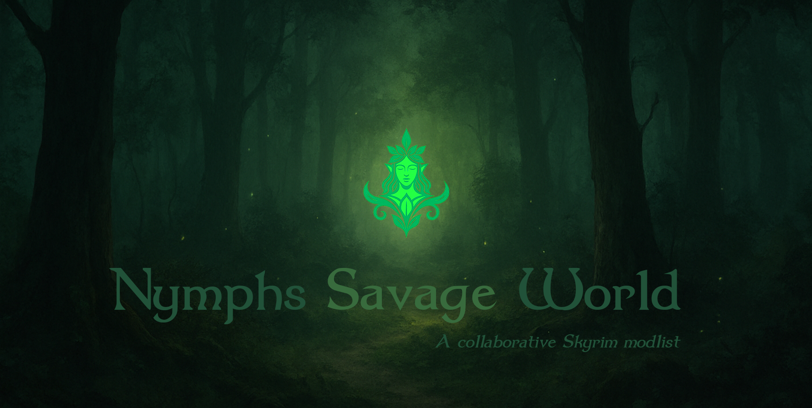

  

<h1 align="center">🌿 Nymphs Savage World</h1>

<em>A collaborative Skyrim modlist — immersive, magical, and consent-driven</em>

  
  
  
  
  

---

⚠️ **Alpha Notice**  
Nymphs Savage World is currently in **Alpha**.  
Performance, balance, and stability are still being worked on — LODs, optimization, and system tuning are not yet complete.  

For now, **please don’t open GitHub issues** unless you are part of the core team.  
Feedback and support should be shared through our [Community Discord](https://discord.gg/ezJVqBJvVj).  

---

## ✨ Feature Highlights

### 🎨 Visuals & Atmosphere
- **Community Shaders v1.3.0** with custom post-processing  
- **PBR textures** for landscapes, buildings, armor, and more  
- Advanced **lighting system**: Light Placer, True Light, Dynamic Window Shadows (test version), Window Shadows Ultimate  
- **Fantasy forests & landscapes**, including the mystical Albion Forest  
- **Azurite III Weather System**, seamlessly integrated with lighting  

### 🗡️ Gameplay & Mechanics
- **MCO Fully Directional Combat System** with multiple movesets (MCM tuning still in progress)  
- **Custom User Interface** with an **Equipment Fast-Change HUD**, designed with **controllers in mind** but fully compatible with **keyboard and mouse**  
- **Odin Magic System** for diverse spellcasting  
- **Master of One Perk System** — streamlined character progression  
- **Gods and Worship Religion System** — roleplay with divine powers  
- **Unique alternate start realm** for fresh beginnings  

### 🏰 World & Roleplay
- Enhanced **capital cities** with more detail and life  
- **Hand-picked player homes** tailored to the fantasy theme  
- **Fantastical creatures** — fairies, dwarves, giants (some recruitable as followers)  
- **Custom followers** with distinct personalities  
- **Nethers Follower Framework** for advanced companion management  
- Expanded **roleplaying opportunities** throughout Skyrim  

### 🧑 Characters & Body Systems
- **High Poly Head** for detailed character models  
- **3BA** (feminine) and **HIMBO** (masculine) body types  
- Visual consistency and compatibility across NPCs and followers  

### 🔞 NSFW Systems
- **OStim NSFW framework** — no nudity or adult content without **explicit player consent**  

…and much more to discover as you explore the world of **Nymphs Savage World**.

---

## 🔗 Important Links

- 📥 **[Wabbajack Download](#)** – Install the modlist with Wabbajack  
- 🗨️ **[Community Discord](https://discord.gg/ezJVqBJvVj)** – Join the community, get support, and share your adventures  
- 📚 **[Nexus Page](https://www.nexusmods.com/skyrimspecialedition/mods/154913)** – Learn more about the mods included in this list  
- 📝 **[Changelog](CHANGELOG.md)** – See what’s new in each release  

---

## ⚙️ Pre-Installation Steps

Before installing **Nymphs Savage World**, please make sure your system and Skyrim setup are ready.

### Requirements
- Skyrim **Anniversary Edition** (latest version, fully updated)  
- At least **500 GB of free disk space** (⚠️ this requirement may increase as the list grows)  
- [Wabbajack](https://www.wabbajack.org/) installed  

### System Preparation
- Increase your **Windows pagefile** (e.g. ≥ 20 GB) to improve stability  
- Install the latest **Visual C++ Redistributables** and **.NET Runtime**  
- Exclude your **Wabbajack and Skyrim folders** from antivirus scanning  

### Steam Settings
- Disable the **Steam Overlay**  
- Set the game language to **English**  
- Disable **Steam Cloud Saves**  
- Right-click Skyrim → Properties → Updates → set to *“Only update this game when I launch it”*  

---

## 💻 Installation Instructions

Follow these steps to install **Nymphs Savage World** using [Wabbajack](https://www.wabbajack.org/):

1. **Download and install Wabbajack**  
   - Place Wabbajack in a simple folder (e.g. `C:\Wabbajack`)  
   - Exclude this folder from antivirus scanning  

2. **Log in to Nexus Mods** inside Wabbajack  
   - Make sure you have a **Premium account** for the smoothest installation (recommended)  

3. **Select Nymphs Savage World** in Wabbajack  
   - Choose an **Installation Location** (e.g. `C:\NSW`)  
   - Choose a **Downloads Location** (e.g. `C:\NSW_Downloads`)  

4. **Start the installation**  
   - Click the **play/start button** in Wabbajack  
   - Be patient — this process can take a long time depending on your connection and hardware  

5. **When complete**, you should see a success message in Wabbajack  
   - If errors occur, check the log and consult the **#support channel on Discord**  

6. **Launching the Modlist**  
   - Use the **Mod Organizer 2 (MO2)** that comes with the installation  
   - Always start the game via **SKSE** inside MO2  

---

## 🔧 Post-Installation Notes

- **Controller Users**: At the bottom of the load order you’ll find a mod called **“Nymphs - Controller”**. Enable this if you want to play with a controller.  
- **Performance & Optimization**: Being in Alpha, the list has **not yet been optimized** for different system configs. Landscapes are heavy, and **LODs are currently missing**. Work will be done later to improve accessibility.  
- **First Launch Quirk**: On the first launch, the game window may appear at the wrong size (Windows DPI scaling issue). It should correct itself on the **second launch**.  
- **MCM Settings**: Some combat-related MCM options still need configuring. Keep an eye on the documentation/Discord for the recommended setup.  

---

## 🐛 Known Issues

As this list is still in **Alpha**, you may encounter problems.  
We track issues in the [Changelog](CHANGELOG.md), but here are the current major ones:

- Performance is **not yet optimized** for lower-end systems  
- **LODs are missing**, making landscapes heavier than normal  
- Some **MCM combat settings** still require manual tweaking  
- On **first launch**, the game window may appear at the wrong size (DPI scaling issue). This usually fixes itself on the second launch  

👉 Please check the [Changelog](CHANGELOG.md) for updates as we work on fixes.  
👉 If you discover new problems, please report them in our [Community Discord](https://discord.gg/ezJVqBJvVj) rather than GitHub Issues (issues will open at Beta).  

---

## 🤝 Contributing

We welcome contributions from the community!  
Whether it’s suggesting mods, reporting bugs, improving configs, or helping with documentation — your input helps make **Nymphs Savage World** better for everyone.

👉 See our [Contributing Guidelines](CONTRIBUTING.md) to learn how you can get involved.

---

## 👥 Credits & Contributors

**Core Team:**  
- babyjaws  
- Rauty79  
- Julio005  

**Special Thanks:**  
- backbeatN  
- Nyx  
- dbottle  
- Dlizzio  
- Herr Schtevie  

---

  <a href="#-nymphs-savage-world">⬆️ Back to top</a>

  <em>Built with 💚 by Nymphs — fully immersive, fully consensual 😉</em> 
  <em>Built with 💚 by Nymphs — press E to interact responsibly</em> 
  <em>Built with 💚 by Nymphs — comes with extra stamina regen 🍃</em> 
  <em>Built with 💚 by Nymphs — embrace the Savage World 🌿</em>

