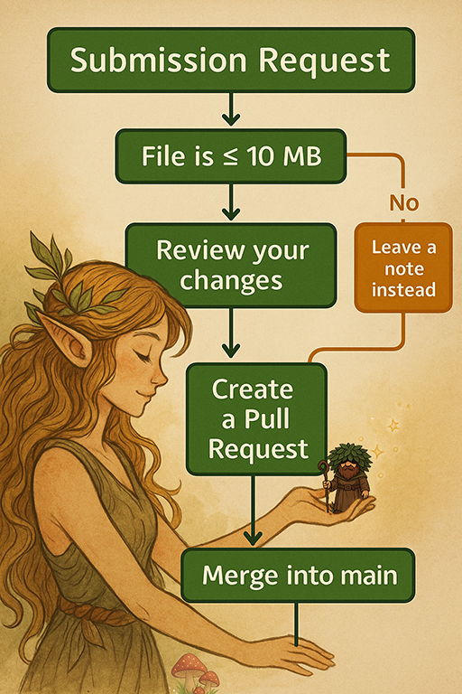

# Submissions

This folder is the drop-zone for contribution requests via Pull Request.  
You don’t need to upload mods — just describe what you’d like to see changed.

---

## ✅ What you can submit

- A single **.md** or **.txt** file with:
  - **Mods to add / remove / update**
  - **Load order notes** (relative positions are fine)
  - **Nexus links** (and any requirements)
  - **Brief reasoning** (performance, visuals, bugfix, balance, etc.)

- Optional small config/patch files (each file ≤ **10 MB**):
  - `.ini`, `.json`, `.toml`, `.yml`
  - Tiny xEdit patches: `.esp`, `.esl`, `.esm`

> 💡 Most PRs will be **request-only**: one text/markdown file with links and notes is perfect.

---

## ❌ Do not upload

- Full mods or large assets (meshes, textures, sounds, animations, DLLs)  
- Anything you **don’t have permission** to redistribute

👉 Instead, **link the Nexus page** and we’ll fetch it during curation.

---

## 📄 Recommended filename

Use your handle + a short topic:

    nymphs-savge-world/Submissions/<yourname>_request_<topic>.md

**Examples**

    Submissions/rauty79_request_weather_tweak.md
    Submissions/lildawn_request_new_skimpy_undies.md
    Submissions/julio005_request_mcm_combat_tweaks.md

---

## 🧩 Suggested template (copy/paste)

    # Submission: <short title>
    **Author:** @<yourname>
    **Type:** ✨ enhancement / 🛠 tweak / ⚖️ balance / 🐛 bug / 📝 docs / 🔧 other 
    (you  will see the "labels" cogwheel on the right hand side when you make your pull request)

    ## Mods to Add
    1) **Mod Name** — <Nexus link>
       - Reason: <why add it?>
       - Notes: <requirements, patches, MCM, etc.>

    ## Mods to Remove/Replace
    - **Mod Name** — Reason: <why remove/replace?>

    ## Load Order / Integration
    - Place **Mod A** after **Mod B**
    - Patch needed for: <list>
    - MCM: <key settings if relevant>

    ## Performance / Risks
    - VRAM/CPU impact: <low/medium/high>
    - Known conflicts: <links or notes>

    ## Screens/Proof (optional)
    - Links or short description

---

## 🔖 Labels to use on your PR

- ✨ enhancement — new features/content  
- 🛠 tweak — small adjustments  
- ⚖️ balance — gameplay balancing  
- 🐛 bug — fixes/crashes/errors  
- 📝 docs — documentation/readme updates  
- 🔧 other — uncategorized  
- 📦 uncategorized — (maintainers’ catch-all)

---

Need help? Ping us on **Discord**: https://discord.gg/ezJVqBJvVj
